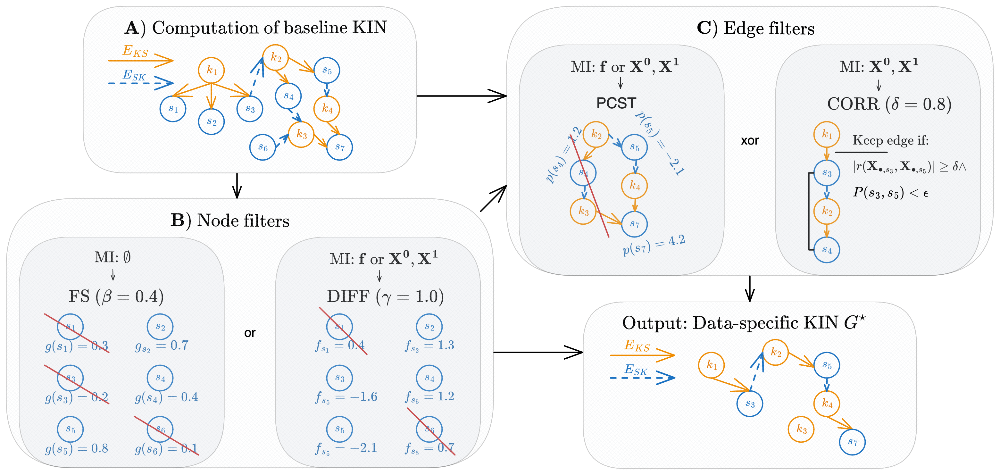
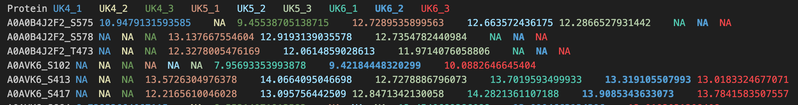
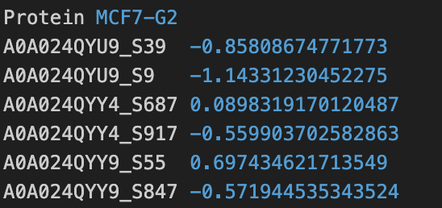

# KINference

This repository contains the source code of **KINference: Data-Driven Inference of Kinase Interaction Networks** alongside two examplery runs. Refer to the [GitHub Evaluation Repository](https://github.com/bionetslab/KINference-Evaluation-Scripts) for the evaluation code and the plotting results.



## Installation instruction

1) Create a conda environment (mamba is recommended):
```
mamba create -n 'KINference' -c conda-forge r-base python
mamba activate KINference
```
2) Install `pcst_fast`
```
pip install pcst_fast
```
3) Install required R packages (in an R terminal):
```
install.packages(c('tidyverse', 'data.table', 'BiocManager', 'devtools', 'argparse'))
devtools::install_github("evocellnet/funscoR")
BiocManager::install(c('OmnipathR', 'UniProt.ws'))
```

## How to run KINference:
KINference has to be executed from the command line and within the git base directory via:
- Matrix based input:
```
Rscript run_KINference.R --x0.path='./data/example_data/example_intensities_x0.tsv' --x1.path='./data/example_data/example_intensities_x1.tsv' --output.path='example_run_results' --output.id='example_cond_run' --species='Human'
```
- Vector based input:
```
Rscript run_KINference.R --f.path='./data/example_data/example_intensities_f.tsv' --output.path='example_run_results' --output.id='example_cond_run' --species='Human'
```


## Parameters:

- `--x1.path`: Path to intensity data of condition 1 (default: NA).
- `--x0.path`: Path to intensity data of condition 0 (default: NA).
- `--f.path`: Path to log2-transformed intensities (default: NA).
- `--output.path`: Path to store the output (default: 'results').
- `--output.id`: Output identifier (default: 'key').
- `--species`: Species name (default: 'Human').
- `--paired_samples`: Bool variable that indicates if the samples are paired. Influences the computation of the log2-transformed intensities. See the paper for a more detailed explanation (default: FALSE).
- `--alpha`: Threshold for the baseline KIN percentile scoring (default: 0.9).
- `--n`: Threshold for the number of edges in the baseline KIN (default: 15).
- `--beta`: Threshold for the FS filter (default: 0.4).
- `--gamma`: Threshold for the DIFF filter (default: 1.0) 
- `--delta`: Threshold for the CORR filter (default: 0.8)
- `--epsilon`: Threshold for the significance test of the CORR filter (default: 0.05)
- `--m`: Threshold for the number of samples needed for correlation calculation (default: 10).

## Input specification:
KINference can be run with either 2 input matrices of intensity measurements of phosphorylation sites or 1 input vector of log2FC-transformed intensities. The inputs have to be provided as tab-separated files. The matrices and the vector must contain one column named `Protein`. This column contains the annotations of the UniprotIDs and the phosphorylated amino acid (AA) and its sequence position (Pos) in UniprotID_AAPos format. See the screenshot for an example.

- Matrix input format:

- Vector input format:
